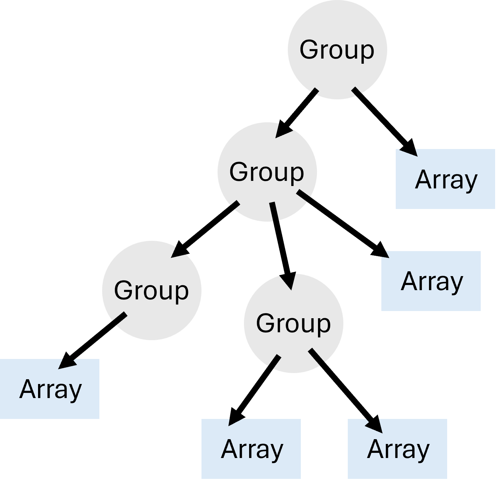
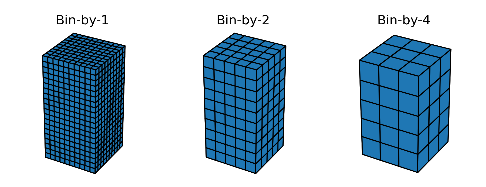
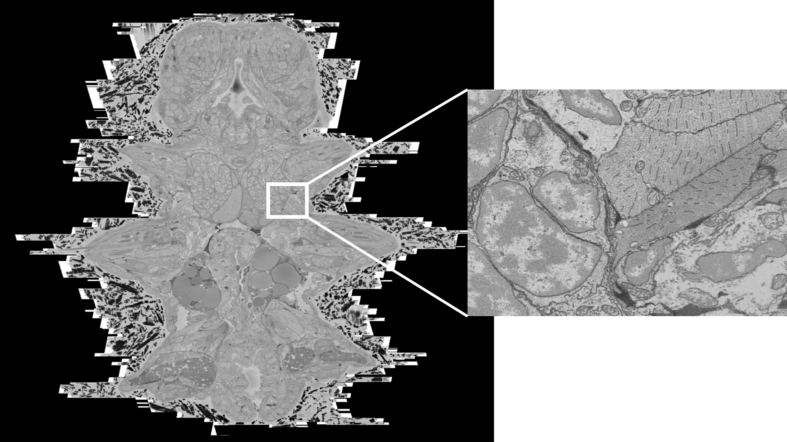

# OME-Zarr introduction

## Recap on Zarr

:::: {.columns}

::: {.column width="40%"}
{fig-alt="Zarr logo"}
:::

::: {.column width="60%"}
- open-source file format specification
- n-dimensional arrays
- split into chunks
- Each chunk is a separate file
- Enables parallel processing of massive datasets
:::

::::

## Working with Zarr

- One of the main libraries for interacting with Zarr in python is [zarr-python](https://zarr.readthedocs.io/en/stable/).

- Quick demo of using zarr-python to make arrays and groups:
`notebooks/zarr_python_example.ipynb`

## What's in a Zarr? {.smaller}

The [zarr specification](https://zarr-specs.readthedocs.io/en/v3.1.0/specs.html) dictates how a Zarr file should be structured.

As we saw in the demo, the main components of a Zarr file are:

- **groups** (which you can think of as containers) and **arrays** (our actual numeric data)
- groups can contain any combination of groups and arrays, allowing a tree of datasets to be made
- each level of the tree (a group or array) contains a `zarr.json` file with basic metadata

## Tree / hierarchy

{fig-align="center"}

## Zarr is general (pros)

One of Zarr's great strengths is that it can be applied to any kind of array data across many fields.

Their website's [dataset section](https://zarr.dev/datasets/) includes:

- climate model outputs
- sea surface temperature
- bio-imaging data
- ...

## Zarr is general (cons)

- Equally, one of Zarr's great weaknesses is that it is general!
- When we use it for a specific kind of data (say biological images), there is no consistent place for related metadata to be stored.

- For example:

  - pixel size?
  - units?
  - meaning of dimensions? E.g. time / z / y / x / channels

## {.center}

**This makes it harder to share datasets with others, and to process datasets that weren't created by yourself.**

## OME-Zarr

Specific fields can get around this limitation by extending the Zarr specification.

- [OME-Zarr](https://ngff.openmicroscopy.org/index.html) = Zarr + bio-imaging related metadata
- It also introduces conventions on how to layout the Zarr files to handle common use cases:
  - multi-resolution datasets (we'll come back to this!)
  - high-content screening
  - storing label images alongside raw images

## Working with OME-Zarr

Let's take a look at some OME-Zarr metadata using [ome-zarr-models](https://ome-zarr-models-py.readthedocs.io/en/stable/).

- OME-Zarr models is a python package specialised to validating and loading OME-Zarr metadata.

- Quick demo of accessing metadata: `notebooks/ome-zarr-models_example.ipynb`

## Multi-scales {.smaller}

Part of the [OME-Zarr specification](https://ngff.openmicroscopy.org/specifications/0.5/index.html) adds `multiscales`
metadata.

- It allows storing the same dataset at multiple resolutions
- May also hear this called a 'pyramidal' file format

. . .

{height=300 fig-align="center"}

## Why multi-scale?

Viewing a whole slice from a multi-terabyte dataset can still be hundreds of GB!

{fig-align="center" width="100%"}

::: footer
Image from Vergara et al. 2021 - Whole-body integration of gene expression and single-cell morphology
:::

## Specialised viewers {.smaller}

Specialised viewers dynamically load different resolution levels.

- Web examples:

  - [neuroglancer - human organ atlas kidney](https://neuroglancer-demo.appspot.com/#!%7B%22dimensions%22:%7B%22x%22:%5B0.00001022%2C%22m%22%5D%2C%22y%22:%5B0.00001022%2C%22m%22%5D%2C%22z%22:%5B0.00001022%2C%22m%22%5D%7D%2C%22position%22:%5B6490.5439453125%2C4794.5%2C6752.15087890625%5D%2C%22crossSectionScale%22:3.678794411714424%2C%22projectionOrientation%22:%5B0.3094263970851898%2C0.20628425478935242%2C0%2C-0.9282791018486023%5D%2C%22projectionScale%22:4096%2C%22layers%22:%5B%7B%22type%22:%22image%22%2C%22source%22:%22zarr://gs://ucl-hip-ct-35a68e99feaae8932b1d44da0358940b/K292/kidney/10.22um_complete-organ_bm18.ome.zarr/%22%2C%22tab%22:%22source%22%2C%22opacity%22:1%2C%22shaderControls%22:%7B%22normalized%22:%7B%22range%22:%5B42776%2C45855%5D%7D%7D%2C%22volumeRendering%22:%22max%22%2C%22volumeRenderingDepthSamples%22:256%2C%22name%22:%22K292_kidney_complete-organ_10.22um_bm18%22%7D%5D%2C%22showSlices%22:false%2C%22selectedLayer%22:%7B%22visible%22:true%2C%22layer%22:%22K292_kidney_complete-organ_10.22um_bm18%22%7D%2C%22layout%22:%224panel%22%7D)
  - [webknossos - segmented connectomics dataaset](https://webknossos.org/datasets/l4dense_motta_et_al_demo-5f33d5340100001800e8cddc/view?utm_source=site#2867,4361,1770,0,1.21)

- Local examples:

  - Napari
  - BigDataViewer (Fiji)
  - ...

## Versioning

Spec versions can get complicated.

- The main [zarr spec](https://zarr-specs.readthedocs.io/en/latest/specs.html) is currently v3
- The [OME-Zarr spec](https://ngff.openmicroscopy.org/specifications/index.html) is currently v0.5
- OME-Zarr changes more often than Zarr

## News from OME-Zarr land

- follow the Announcements for the `ome-ngff` tag on [image.sc](https://forum.image.sc/tag/ome-ngff/1502)
- Join a community call or office hours - [community pages](https://ngff.openmicroscopy.org/community/index.html#)
- [ngff docs](https://ngff.openmicroscopy.org/index.html)

## Ecosystem

The ecosystem of tools / packages around OME-Zarr is rapidly evolving.

Don't be afraid to try different options, and see what works best for your data.

- The [resources section](https://ngff.openmicroscopy.org/resources/index.html) has useful lists of tools, training materials etc for OME-Zarr
- [Tools list](https://ngff.openmicroscopy.org/resources/tools/index.html)
- [Training materials](https://ngff.openmicroscopy.org/resources/learning-and-teaching-material/index.html)

## Try it out!

- `notebooks/creating_ome_zarr.ipynb`: creating OME-Zarr step by step
- `notebooks/converting_ome_zarr.ipynb`: libraries for converting to OME-Zarr
- `notebooks/visualising_ome_zarr.ipynb`: viewing OME-Zarr in napari
