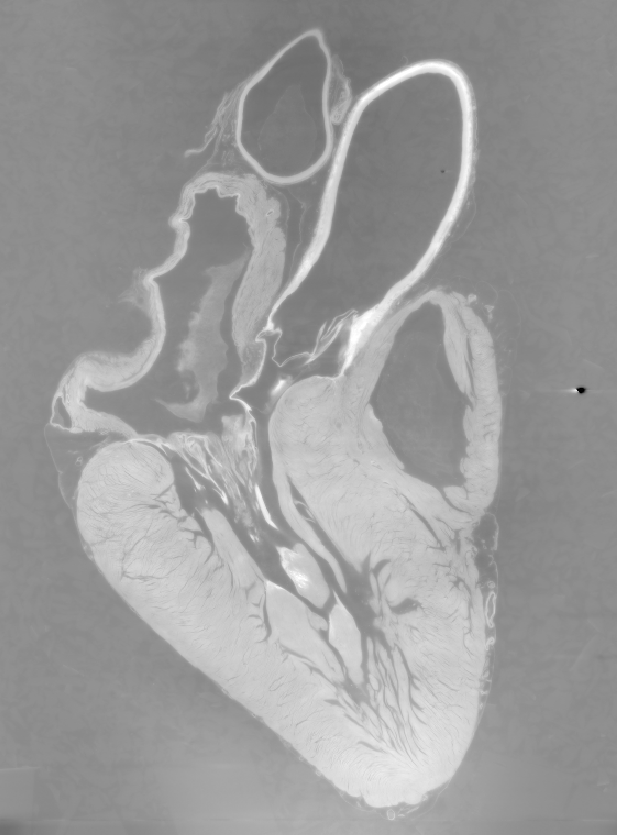
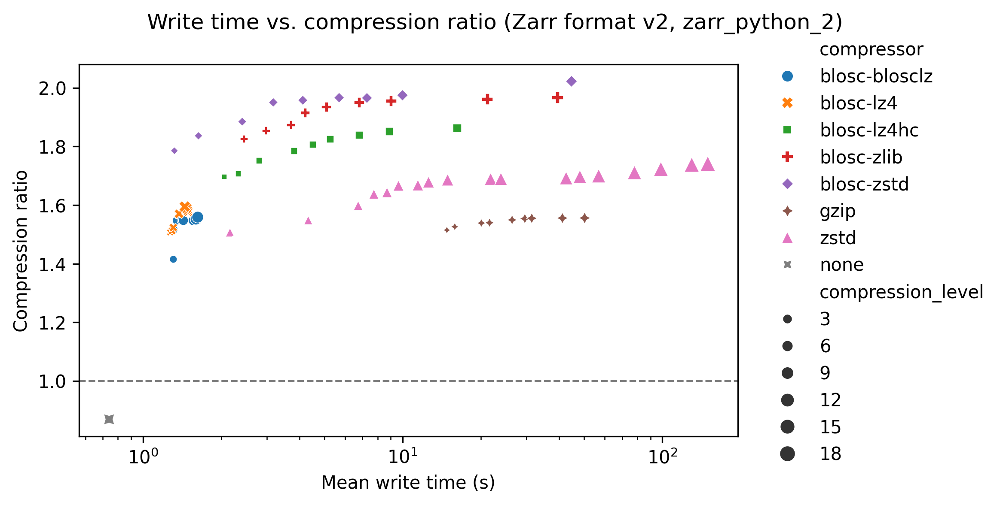
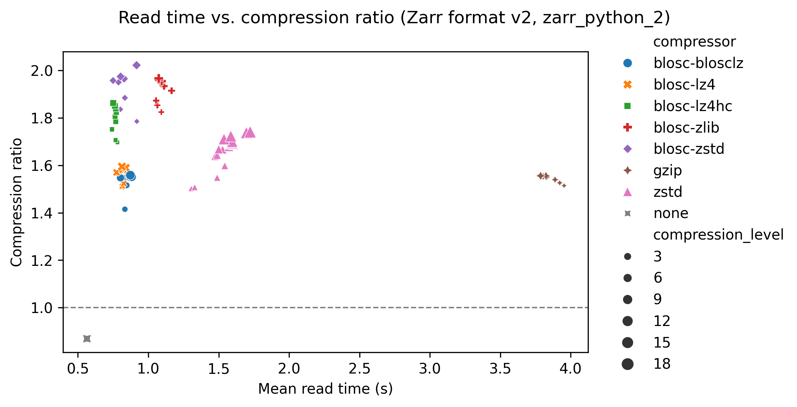
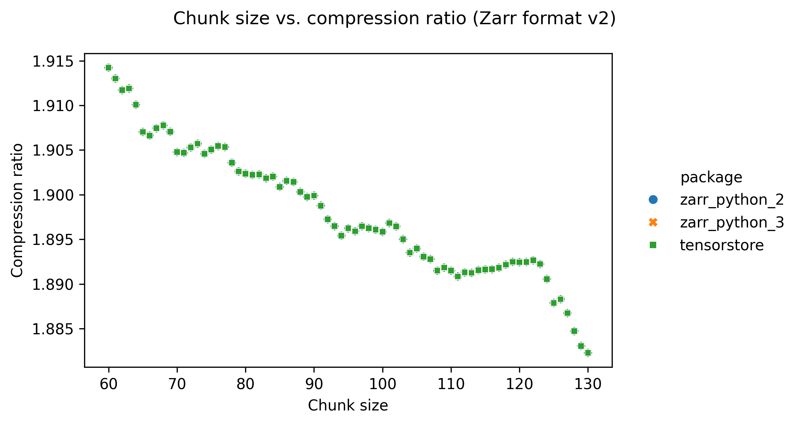
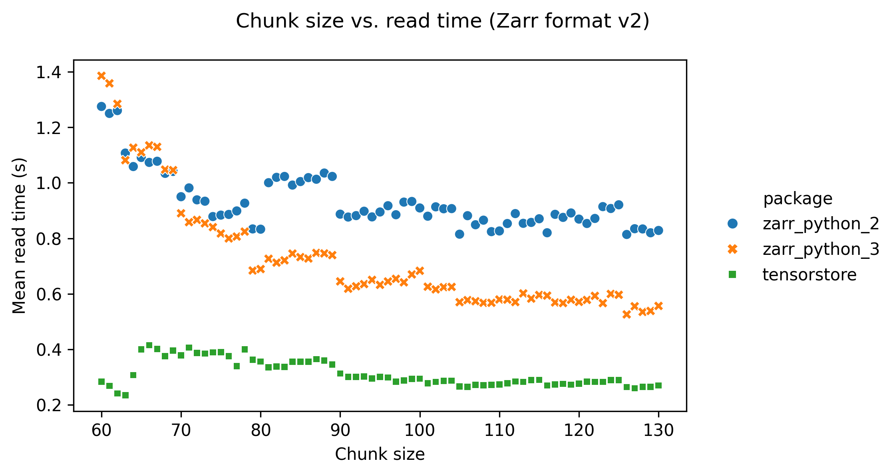
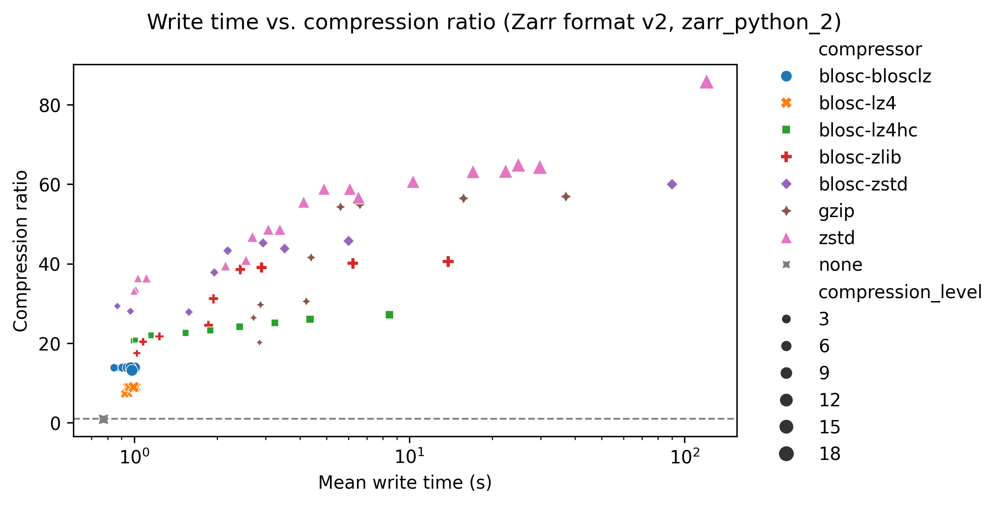
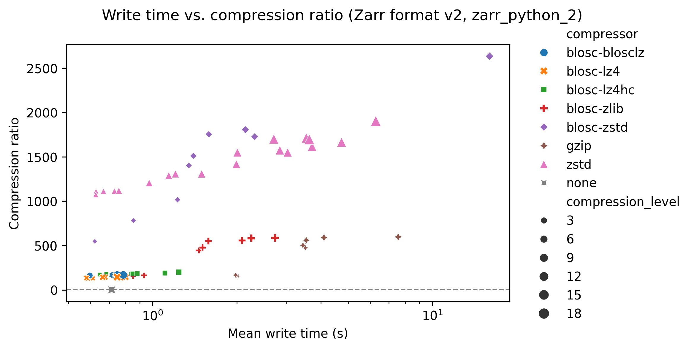
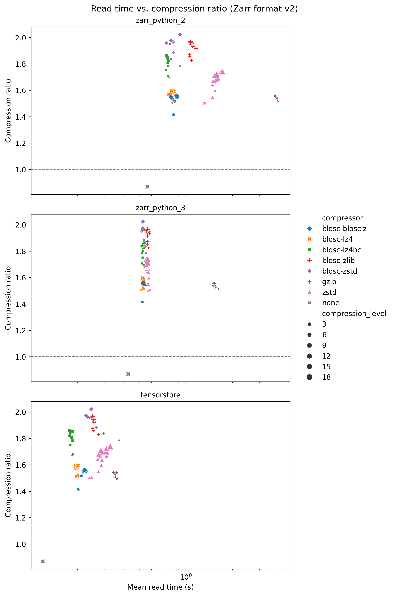

# Zarr benchmarks

## Recap on Zarr {.smaller}

:::: {.columns}

::: {.column width="40%"}
{fig-alt="Zarr logo"}
:::

::: {.column width="60%"}
- open-source file format specification
- n-dimensional arrays
- split into chunks
- Each chunk is a separate file
- Enables parallel processing of massive datasets
- OME-Zarr extends this with bioimaging-related metadata + multiscales
:::

::::

## Zarr settings

There are lots of settings that can be adjusted when writing Zarr and OME-Zarr images:

- Chunk size
- Compressor
- Compression level
- Other compressor options like 'shuffle'
- ...

## How to choose?

These settings affect:

- Write time
- Read time
- Size on disk
- Number of files
- Memory usage for different operations

- Choosing settings is a trade-off between these different factors. You have to decide what you want to prioritise for your data.

## HEFTIE Project

:::: {.columns}

::: {.column width="40%"}
{fig-alt="HEFTIE logo" height=300}
:::

::: {.column width="60%"}
Benchmarks were made as part of the [HEFTIE project](https://github.com/HEFTIEProject):

  - David Stansby, Ruaridh Gollifer and Kimberly Meechan (UCL ARC)
  - Also made the online [OME-Zarr book](https://ome-zarr-book.readthedocs.io/) that we used some exercises from yesterday.
:::

::::

## Benchmarks

- [Benchmarks repository](https://github.com/HEFTIEProject/zarr-benchmarks)
- [Benchmarks report](https://heftieproject.github.io/zarr-benchmarks/)

- 3 images: heart (335 MB), dense segmentation, sparse segmentation
- [Images used are on zenodo](https://zenodo.org/records/15691492)
- All sized 806 x 629 x 629
- All 16-bit unsigned integer

## Images

:::: {.columns}

::: {.column}

**Heart: HiP-CT scan of a heart from the Human Organ Atlas**

:::
::: {.column}
{height=450}
:::
::::

## Images

:::: {.columns}
::: {.column}

**Dense: segmented neurons from electron microscopy**

:::
::: {.column}
{height=450}
:::
::::

## Images

:::: {.columns}
::: {.column}

**Sparse: A few select segmented neurons from electron microscopy**

:::
::: {.column}
{height=450}
:::
::::

## Benchmarks

- [`pytest-benchmark`](https://pytest-benchmark.readthedocs.io/en/latest/)
- Vary different settings and record:
  - Time to write the whole array (lower is better)
  - Time to read the whole array (lower is better)
  - Compression ratio: data size in memory / data size on disk (higher is better)
- Each run 5 times and mean values used

## Write time

{}

## Read time

{}

## Chunk size

{}

## Chunk size

{}

## Image type

Heart image
{}
Dense segmentation
{}
Sparse segmentation
{}

Segmentations compress much more!

## Software library
{fig-align="center" height=1500}

Which software library you use affects read / write times. [Tensorstore](https://google.github.io/tensorstore/) had the best performance.

## Benchmarking Zarr conclusions {.smaller}

Some general recommendations:

-  Use `tensorstore` library for fastest read/write
-  `blosc-zstd` is a good default compressor
-  Use a high compression level to get the smallest file size (usually means longer write times, but not much effect on read time)
-  Smaller chunks = smaller overall file size + less memory usage
- Larger chunks = faster read/write times + fewer files
-  It's a balance! People often use 64x64x64 or 128x128x128

- This is different for different data! Worth testing some small samples of your own data with different settings

## Sharding

One of the settings we didn't benchmark was 'sharding':

- Shards contain multiple chunks
- Each shard is a file on disk (rather than each individual chunk)
- A chunk is the smallest unit you can read; a shard is the smallest unit you can write
- Main purpose is to reduces number of files
- Some file systems may have performance issues storing and accessing a large number of small files.

## Benchmarking sharding

Let's experiment with sharding options:

- `notebooks/sharding.ipynb`
